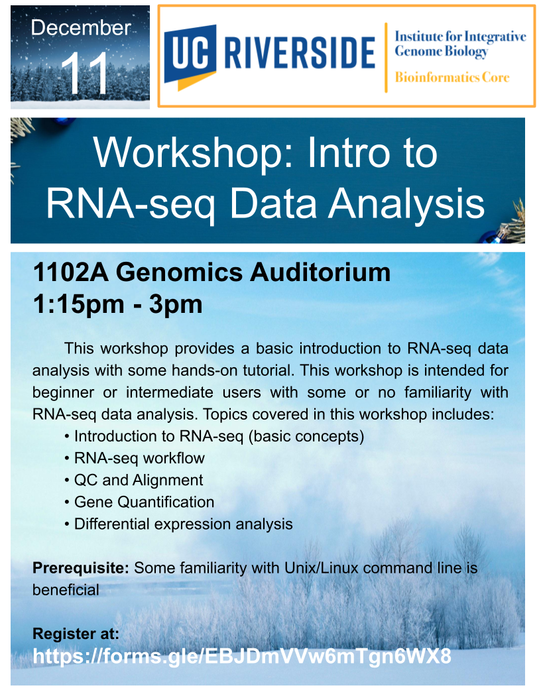

# RNA-Seq-Workshop

<figure>

</figure>

This workshop provides a basic introduction to RNA-seq data analysis with some hands-on tutorial. This workshop is intended for beginner or intermediate users with some or no familiarity with RNA-seq data analysis. 

Topics covered in this workshop includes:

• Introduction to RNA-seq (basic concepts)
• RNA-seq workflow
• QC and Alignment
• Gene Quantification
• Differential expression analysis

Prerequisite: Some familiarity with Unix/Linux command line is beneficial  

# General Information  
**Date:** December 11, 2025
**Time:** 1:15PM - 3PM  
**Location:** 1102A Genomics Auditorium  
**Format:** In-Person

# Registration
Register for the workshop at: https://forms.gle/EBJDmVVw6mTgn6WX8

# Requirements
Attendees should have a laptop (Mac or PC) to follow along in the workshop. If you don’t have a laptop, you can check one out at the [Tomas Rivera](https://library.ucr.edu/libraries/tomas-rivera-library) or [Orbach Science Library](https://library.ucr.edu/libraries/orbach-science-library). Go to the library circulation desk for more information.
